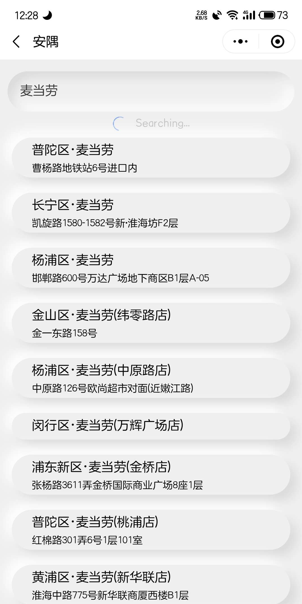

### 项目说明

本项目旨在帮助大家更好的找到出租房. ~~目前主要是爬取房源, 如果用户量大, 有机会的话也希望做自己的房源发布平台~~

### 技术栈

这是一个全栈项目, 使用到的技术有且不限于

- 基于 Taro 的小程序
- node 后端
- python 爬虫
- mongoDb
- docker/docker-compose
- nginx

### 小程序预览

### 已实现的功能

目前的版本较为简单, 仅仅实现了最基本的功能, 浏览房源, 按地铁站, 或者搜索(限会员, 用户每月可领取两次免费会员). 在有限的条件内进行订阅. 发送通知等等...

### TODO

我对这个项目想了很多, 想做的功能也很多, 但是心有余而力不足... 平时也很忙, 需要学习...

- [ ] 搭建 IM 系统, 允许用户发布合租请求 `这个功能是很有必要的, 可以帮助刚毕业的大学生以较低的价格, 租到更好的房子`
- [x] 重构爬虫, ~~动态创建 container~~ `目前的爬虫还是比较简单的, 有的时候链接多了爬不过来`
- [ ] ...多的不说了,来不及做了

### 最后

本人精力有限, 项目中难免有考虑不完善或者出错的, 代码效率低下的地方, 如有问题请指出, 谢谢.

### 赞助此项目

目前服务器及相关费用由本人独自承担(~~两台玩具机,一台c5.xlarge~~), 后期如果想加入短信通知功能的话也是一笔支出. 如果本项目帮助到你, 有能力的话希望可以打赏一下~ Thanks♪(･ω･)ﾉ

